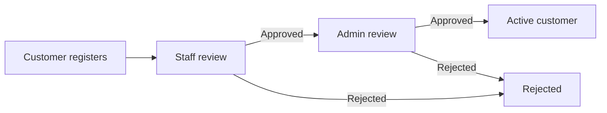
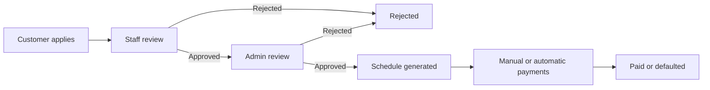
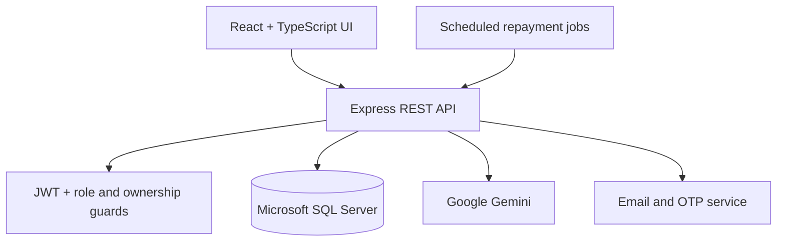

<div align="center">

```
██████╗  █████╗ ███╗   ██╗██╗  ██╗███╗   ███╗██╗███╗   ██╗██████╗
██╔══██╗██╔══██╗████╗  ██║██║ ██╔╝████╗ ████║██║████╗  ██║██╔══██╗
██████╔╝███████║██╔██╗ ██║█████╔╝ ██╔████╔██║██║██╔██╗ ██║██║  ██║
██╔══██╗██╔══██║██║╚██╗██║██╔═██╗ ██║╚██╔╝██║██║██║╚██╗██║██║  ██║
██████╔╝██║  ██║██║ ╚████║██║  ██╗██║ ╚═╝ ██║██║██║ ╚████║██████╔╝
╚═════╝ ╚═╝  ╚═╝╚═╝  ╚═══╝╚═╝  ╚═╝╚═╝     ╚═╝╚═╝╚═╝  ╚═══╝╚═════╝
```

### A full-stack, AI-powered banking management system

[](https://nodejs.org)
[](https://reactjs.org)
[](https://typescriptlang.org)
[](https://microsoft.com/sql-server)
[](LICENSE)

**[Features](#-features)** • **[Architecture](#-architecture)** • **[Quick Start](#-quick-start)** • **[Project Structure](#-project-structure)** • **[Roadmap](#-roadmap)**

</div>

<br>

## 📖 Overview

**BankMind** is a role-based banking management platform for administrators, bank staff, and customers. It covers customer onboarding, account approvals, transactions, loan processing, automated repayments, fraud review, support tickets, notifications, statement exports, and an AI banking assistant grounded in each customer's live financial data.

The application is built with a **React + TypeScript** frontend, a **Node.js + Express** backend, **Microsoft SQL Server**, **JWT authentication**, scheduled repayment jobs, and **Google Gemini** for customer-facing AI chat.

> [!NOTE]
> BankMind is an educational and portfolio project. Review its security, compliance, privacy, and operational controls before using it in a production banking environment.

<br>

## ✨ Features

### Role-based dashboards

| Role | Main capabilities |
|---|---|
| **Admin** | Manage staff, approve customers and loans, configure loan policies, review fraud alerts, assign support tickets, view system statistics |
| **Bank Staff** | Review assigned customers, approve accounts, perform first-level loan review, manage assigned support tickets, monitor activity |
| **Customer** | Manage accounts, deposit, withdraw, transfer funds, apply for loans, make repayments, view statements, contact support, use the AI assistant |

### 🔐 Authentication & access control
- JWT-based authentication with role guards
- Separate staff and customer registration/login flows
- OTP verification with resend support
- Protected frontend routes
- Customer ownership middleware to prevent cross-customer access
- Automatic session-expiry detection and redirect
- Centralized handling of unauthorized API responses

### 👥 Customer & account management
- Two-level customer approval: **Staff → Admin**
- Permanent association with the first approving staff member
- Customer suspension and reactivation
- Savings and current accounts with separate balances
- Single-level account approval by staff
- Account approval, rejection, and status tracking

### 💸 Transactions & statements
- Deposits, withdrawals, and account-to-account transfers
- Per-account transaction history with running balances
- Date-range filtering
- Statement export to **CSV**, **Excel**, and **PDF**
- Silent balance polling without a full page refresh

### 🏦 Loans & repayments
- Configurable loan policies, interest rates, duration ranges, and activation status
- Two-level loan approval: **Staff → Admin**
- Simple-interest calculation with live frontend preview
- Automatic repayment schedule generation after final approval
- Due dates aligned to the loan's start day of the month
- Manual installment payments
- Balloon payments for multiple selected installments
- Optional automatic deductions
- Failed-deduction tracking — a loan is marked **DEFAULTED** after three failures
- Admin loan details, remarks, approval actions, and repayment schedule view
- Test endpoint for safely triggering auto-deduction during development

### 🚨 Fraud review
- Admin queues for unresolved and historical fraud alerts
- Detailed review with customer and account information
- Resolve alerts as **CLEARED** or **BLOCKED**
- Blocking freezes the affected account
- If it's the customer's only account, blocking also suspends the customer

### 🎫 Support tickets
- Customers create tickets, view their tickets, and reply in a conversation thread
- Staff view and manage their assigned queue
- Admins view, filter, assign, and update all tickets
- Ticket lifecycle and priority visibility across dashboards
- Open and in-progress tickets surfaced before resolved items

### 🤖 AI banking assistant
- Floating customer chat interface
- New conversations, session history, and message threads
- Google Gemini integration using `gemini-3.5-flash-lite`
- Responses grounded in the authenticated customer's live accounts, loans, and transactions
- Guardrails against hallucinated account data, financial advice, and cross-customer leakage
- Per-customer in-memory rate limiting: **8 messages/minute**

### 🔔 Notifications & dashboard updates
- Reusable notification helpers for staff, admins, and customers
- Registration, approval, rejection, transaction, and loan notifications
- Toast notifications instead of blocking browser alerts
- Silent dashboard polling every 5 seconds where configured
- Customer balance refresh every 10 seconds
- Polling pauses while modals are open to prevent UI disruption

<br>

## 🔄 Business Workflows

### Customer onboarding



The first staff member who approves a customer is permanently stored as that customer's assigned staff member.

### Loan lifecycle



### Scheduled repayment processing

| Time | Job | Purpose |
|---|---|---|
| `00:05` daily | Mark overdue installments | Updates unpaid installments that have passed their due date |
| `00:10` daily | Process automatic deductions | Attempts payment for all eligible auto-deduct loans |

Both jobs run in the `Asia/Karachi` timezone and start only after the database connection is established.

<br>

## 🏗 Architecture



### Tech stack

| Layer | Technologies |
|---|---|
| **Frontend** | React 18, TypeScript, Vite, Tailwind CSS, Lucide React |
| **Backend** | Node.js 18+, Express.js |
| **Database** | Microsoft SQL Server 2019+ |
| **Authentication** | JSON Web Tokens, OTP verification, role-based authorization |
| **AI** | Google Gemini API |
| **Background jobs** | Daily cron jobs (`Asia/Karachi` timezone) |
| **Exports** | CSV, Excel (SheetJS), PDF |

<br>

## 🚀 Quick Start

### Prerequisites

- Node.js **18+**
- Microsoft SQL Server **2019+**
- npm
- A Google Gemini API key (for the AI chat feature)
- Email/SMTP credentials (for OTP delivery)

### 1 · Clone the repository

```bash
git clone https://github.com/sheikhalyan/BankMind.git
cd BankMind
```

### 2 · Create and populate the database

The repository includes a combined SQL Server setup script containing both:

- **Schema** — tables, relationships, constraints, and other required database objects
- **Data** — the initial records required to run and evaluate the application

Run the following script in **SQL Server Management Studio (SSMS)** before starting the backend:

```
Database/BankMind_Schema_And_Data.sql
```

**Recommended setup:**

1. Open SQL Server Management Studio and connect to your SQL Server instance.
2. Open `Database/BankMind_Schema_And_Data.sql`.
3. Review the target database name and script contents.
4. Execute the script to create the BankMind schema and insert its included data.
5. Confirm the script completes successfully, then use the same database name in `Back-End/.env`.

> [!CAUTION]
> Review the script before running it against an existing database. Use a new or backed-up database to avoid overwriting or conflicting with existing objects and data.

### 3 · Configure the backend

Install the backend dependencies:

```bash
cd Back-End
npm install
```

Create `Back-End/.env` and configure the variables used by your database, JWT, email, and Gemini setup. A typical configuration is shown below — match the exact names expected by the files in `config/` and the AI chat controller.

```env
PORT=5000

DB_HOST=localhost
DB_USER=your_database_user
DB_PASSWORD=your_database_password
DB_DATABASE=BankMind

JWT_SECRET=replace_with_a_long_random_secret

EMAIL_USER=your_email@example.com
EMAIL_PASSWORD=your_email_app_password

GEMINI_API_KEY=your_gemini_api_key
```

> [!IMPORTANT]
> Never commit `.env` files or real credentials to source control.

Start the API:

```bash
npm start
```

The repayment cron jobs are registered after the database connects successfully.

### 4 · Configure the frontend

Open another terminal:

```bash
cd Front-End
npm install
npm run dev
```

If the frontend uses an environment variable for the API base URL, create `Front-End/.env`:

```env
VITE_API_URL=http://localhost:5000/api
```

Open **http://localhost:5173** in your browser.

<br>

## 🔌 API Modules

All endpoints are grouped under `/api` and protected according to their role and ownership requirements.

| Module | Route area | Purpose |
|---|---|---|
| **Authentication** | `/api/auth` | Registration, login, OTP verification, and resend |
| **Users** | `/api/users` | Profiles, updates, and password changes |
| **Admin** | `/api/admin` | Staff, customer approvals, policies, statistics, and fraud review |
| **Customers** | `/api/customers` | Customer registration, approvals, suspension, and reactivation |
| **Accounts** | `/api/accounts` | Account creation, approval, rejection, and retrieval |
| **Transactions** | `/api/transactions` | Deposits, withdrawals, transfers, and history |
| **Loans** | `/api/loans` | Applications and staff/admin decisions |
| **Loan repayments** | `/api/loan-repayments` | Schedules, payments, auto-deduction, and overdue processing |
| **Notifications** | `/api/notifications` | List, read-state updates, and deletion |
| **Support** | `/api/support-tickets` | Ticket creation, assignment, replies, filters, and status updates |
| **AI chat** | `/api/ai-chat` | Chat sessions, messages, and grounded AI responses |

### Development-only repayment trigger

The project includes an endpoint used to test automatic deductions:

```http
POST /api/loan-repayments/test-auto-deduct
Content-Type: application/json

{
  "force": true
}
```

> [!WARNING]
> Restrict or remove this endpoint before production deployment.

<br>

## 📂 Project Structure

```
BankMind/
├── Database/
│   └── BankMind_Schema_And_Data.sql   # Complete SQL Server schema and included data
├── Back-End/
│   ├── config/                        # Database and email configuration
│   ├── controllers/                   # Authentication, banking, loans, AI, fraud and support logic
│   ├── middlewares/                   # JWT authentication and customer ownership checks
│   ├── models/                        # SQL Server data-access models
│   ├── routes/                        # Express route modules
│   ├── utils/                         # Notification and OTP helpers
│   ├── cronJob.js                     # Overdue and auto-deduction schedules
│   ├── server.js                      # API entry point
│   └── package.json
├── Front-End/
│   ├── src/
│   │   ├── components/                # Chat, notifications, profile, statements, routing, toasts
│   │   ├── context/                   # Authentication state and session management
│   │   ├── hooks/                     # Silent polling hook
│   │   ├── pages/                     # Admin, staff and customer dashboards; login and registration
│   │   ├── services/                  # Typed API service modules
│   │   ├── types/                     # Shared TypeScript types
│   │   ├── App.tsx
│   │   └── main.tsx
│   ├── tailwind.config.js
│   ├── vite.config.ts
│   └── package.json
├── LICENSE
└── README.md
```

<details>
<summary><strong>📁 Detailed backend modules</strong></summary>

```
Back-End/
├── config/
│   ├── db.js
│   └── email.js
├── controllers/
│   ├── Loanrepaymentcontroller.js
│   ├── accountController.js
│   ├── adminController.js
│   ├── aichatController.js
│   ├── authController.js
│   ├── customerController.js
│   ├── loanController.js
│   ├── notificationController.js
│   ├── supportticketController.js
│   ├── transactionController.js
│   └── userController.js
├── middlewares/
│   ├── authMiddleware.js
│   └── customerOwnershipMiddleware.js
├── models/
│   ├── Accountapprovalmodel.js
│   ├── Accountmodel.js
│   ├── Aichatmessagemodel.js
│   ├── Aichatsessionmodel.js
│   ├── Customerapprovalmodel.js
│   ├── Customerauthmodel.js
│   ├── Customermodel.js
│   ├── Fraudlogmodel.js
│   ├── Loanapprovalmodel.js
│   ├── Loanautodeductionmodel.js
│   ├── Loanmodel.js
│   ├── Loanpolicymodel.js
│   ├── Loanrepaymentmodel.js
│   ├── Notificationmodel.js
│   ├── Otpmodel.js
│   ├── Supportticketmodel.js
│   ├── Ticketreplymodel.js
│   ├── Transactionmodel.js
│   └── Usermodel.js
├── routes/
│   ├── Loanrepaymentroutes.js
│   ├── accountRoutes.js
│   ├── adminRoutes.js
│   ├── aichatRoutes.js
│   ├── authRoutes.js
│   ├── customerRoutes.js
│   ├── loanRoutes.js
│   ├── notificationRoutes.js
│   ├── supportticketRoutes.js
│   ├── transactionRoutes.js
│   └── userRoutes.js
├── utils/
│   ├── notifications.js
│   └── otp.js
├── cronJob.js
├── server.js
└── package.json
```

</details>

<details>
<summary><strong>📁 Detailed frontend modules</strong></summary>

```
Front-End/src/
├── components/
│   ├── AichatBubble.tsx
│   ├── DateRangePicker.tsx
│   ├── NotificationBell.tsx
│   ├── ProfileModal.tsx
│   ├── ProtectedRoute.tsx
│   ├── Router.tsx
│   ├── StatementDownload.tsx
│   └── Toast.tsx
├── context/
│   └── AuthContext.tsx
├── hooks/
│   └── usePolling.ts
├── pages/
│   ├── AdminDashboard.tsx
│   ├── CustomerDashboard.tsx
│   ├── Login.tsx
│   ├── Register.tsx
│   └── UserDashboard.tsx
├── services/
│   ├── account.ts
│   ├── admin.ts
│   ├── api.ts
│   ├── auth.ts
│   ├── chat.ts
│   ├── loan.ts
│   ├── notification.ts
│   ├── profile.ts
│   ├── support.ts
│   ├── transaction.ts
│   └── user.ts
├── types/
│   └── index.ts
├── App.tsx
├── index.css
├── main.tsx
└── vite-env.d.ts
```

</details>

<br>

## 🛡 Security Notes

- Keep JWT, database, email, and Gemini secrets outside source control
- Enforce authentication, role checks, and ownership checks on every sensitive endpoint
- Restrict the forced auto-deduction test endpoint outside development
- The AI assistant must receive only the authenticated customer's scoped data
- The current AI rate limiter is in-memory and should move to a shared store for multi-instance deployments
- Add confirmation before destructive fraud actions such as blocking an account
- Add login throttling, secure headers, request validation, and production-grade audit logging before deployment

<br>

## 🗺 Roadmap

**Shipped**

- [x] Role-based authentication and protected dashboards
- [x] OTP verification
- [x] Customer and account approval workflows
- [x] Deposit, withdrawal, transfer, and statement export
- [x] Two-level loan approval and configurable loan policies
- [x] Repayment schedules, balloon payments, and automatic deductions
- [x] Fraud review and account blocking
- [x] Customer, staff, and admin support tickets
- [x] Gemini-powered customer assistant
- [x] Silent polling, toast notifications, and session-expiry handling

**In progress / planned**

- [ ] Review and tighten ticket endpoint role restrictions
- [ ] Add a confirmation step before blocking an account
- [ ] Add login rate limiting
- [ ] Complete password-reset review
- [ ] Review profile and statement-download edge cases
- [ ] Add comprehensive unit, integration, and end-to-end tests
- [ ] Add full audit logging
- [ ] Add pagination for large datasets
- [ ] Complete mobile responsiveness review
- [ ] Prepare secure production deployment

<br>

## 🤝 Contributing

Contributions are welcome.

```bash
# Fork and clone the repository
git clone https://github.com/sheikhalyan/BankMind.git
cd BankMind

# Create a feature branch
git checkout -b feature/your-feature-name

# Commit your changes
git commit -m "feat: add your feature description"

# Push the branch and open a pull request
git push origin feature/your-feature-name
```

Please follow [Conventional Commits](https://www.conventionalcommits.org/) for commit messages.

<br>

## 📄 License

This project is licensed under the terms in the [LICENSE](LICENSE) file.

<br>

## 👤 Author

**Sheikh Alyan**

<br>

## 🙏 Acknowledgments

- [Google Gemini](https://ai.google.dev/) — AI assistant
- [Lucide React](https://lucide.dev/) — Icon library
- [Tailwind CSS](https://tailwindcss.com/) — Utility-first styling
- [SheetJS](https://sheetjs.com/) — Excel export
- [Microsoft SQL Server](https://www.microsoft.com/sql-server) — Database platform

<br>

<div align="center">

**Built with ❤️ by Sheikh Alyan**

For support, please open an issue.

</div>